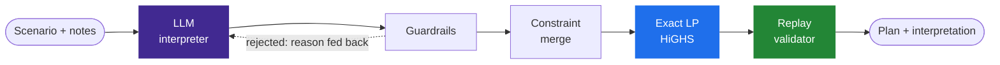

<div align="center">

# GridWise Scheduler

**Plain-English operator notes in. A provably cheapest, fully validated 24-hour energy plan out.**

[](https://github.com/nahinio/gridwise-scheduler/actions/workflows/ci.yml)
[](https://github.com/nahinio/gridwise-scheduler/actions/workflows/docker-publish.yml)


[**Live API**](https://gridwise-scheduler-production.up.railway.app/health) · [**Interactive docs**](https://gridwise-scheduler-production.up.railway.app/docs) · [Architecture notes](docs/architecture.md)

</div>

---

A campus runs on grid power, rooftop solar and a battery. Operators leave notes like
*"panel washing from noon until 2 PM, expect about a quarter of normal solar"* or
*"keep at least 90 kWh in the battery from 6 PM until 10 PM"*.

GridWise Scheduler reads those notes with a language model, turns them into strict,
machine-checked constraints, and solves for the minimum-cost schedule that honours every one
of them. Every plan is replayed against the full rule set before it leaves the service.



## Quick start

**Docker** — the published image, pinned by digest:

```bash
docker run --rm -p 8000:8000 -e OPENAI_API_KEY=<your-key> \
  ghcr.io/nahinio/gridwise-scheduler@sha256:c7f733c81c33b988cec6da3604aed4fb6a1ac0f4a20ef843132d9316651fbfcb
```

**From source** — Python 3.11+:

```bash
git clone https://github.com/nahinio/gridwise-scheduler.git && cd gridwise-scheduler
cp .env.example .env                 # set OPENAI_API_KEY

uv sync && uv run python -m app      # or: pip install -r requirements.txt && python -m app
```

<sub>`docker compose up --build` works too. The service listens on `0.0.0.0:8000` (override with `PORT`). Without an API key it still starts, in a clearly logged deterministic-only mode.</sub>

**Try it**

```bash
curl http://localhost:8000/health
# {"status":"ok"}

curl -X POST http://localhost:8000/optimize-energy \
     -H "Content-Type: application/json" \
     --data-binary @samples/SAMPLE-06.input.json
# compare with samples/SAMPLE-06.output.json  ->  total_cost_bdt: 34090

uv run python -m tools.check --url http://localhost:8000 --edge     # full end-to-end verification
```

<sub>Windows PowerShell: use `curl.exe`. The same commands work against the live URL.</sub>

## API

| Method | Path | Description |
|---|---|---|
| `GET` | `/health` | Readiness probe → `{"status":"ok"}`. Touches no dependency. |
| `POST` | `/optimize-energy` | 24 hourly entries + battery + 1–3 notes → interpretation and schedule. |
| `GET` | `/docs` | Interactive OpenAPI documentation. |
| `GET` `POST` | `/stats` · `/interpret` | Optional diagnostics: aggregate metrics, and the LLM + guardrail stage on its own. |

<details>
<summary><b>Request and response shape</b></summary>

```jsonc
// POST /optimize-energy
{
  "scenario_id": "GRID-101",
  "operator_notes": ["Solar output will drop to about 20% from 1 PM to 3 PM."],
  "hours": [ { "hour": 0, "demand_kwh": 180, "solar_kwh": 0, "tariff_bdt_per_kwh": 7 } /* x24 */ ],
  "battery": {
    "capacity_kwh": 500, "initial_energy_kwh": 200, "minimum_energy_kwh": 50,
    "max_charge_kwh_per_hour": 100, "max_discharge_kwh_per_hour": 100
  }
}
```

```jsonc
// 200 OK
{
  "scenario_id": "GRID-101",
  "directive_interpretation": [
    { "note_index": 0, "applies": true, "directive_type": "solar_reduction",
      "structured_adjustment": { "hours": [13, 14], "factor": 0.2 },
      "explanation": "Solar falls to 20% of forecast from 13:00 to 15:00." }
  ],
  "hourly_plan": [
    { "hour": 0, "grid_kwh": 180, "solar_used_kwh": 0, "battery_action": "idle",
      "battery_kwh": 0, "battery_energy_after_kwh": 200 } /* x24 */
  ],
  "total_grid_kwh": 2395.0, "total_cost_bdt": 34090.0, "peak_grid_kwh": 175.0,
  "plan_summary": "..."
}
```

Full pairs: [`samples/`](samples/).
</details>

<details>
<summary><b>Status codes</b></summary>

| Status | When |
|---|---|
| `200` | Success — **including** any LLM provider outage or malformed model output (handled by the fallback chain). |
| `400` | Malformed JSON, wrong types, missing fields, not exactly 24 unique hours 0–23, zero or more than three notes, blank note, negative / `NaN` / infinite numbers, body over 256 KB. |
| `422` | Well-formed but contradictory battery (`minimum ≤ initial ≤ capacity` violated). |
| `500` | Unexpected error. The body is a fixed envelope; tracebacks go to logs only. |

Unknown extra fields are ignored, and the body is parsed regardless of `Content-Type`.

```json
{ "error": "bad_request", "detail": [{ "field": "hours", "message": "hours must contain exactly 24 entries" }], "request_id": "…" }
```
</details>

### Supported directives

| `directive_type` | Effect on the schedule | `structured_adjustment` |
|---|---|---|
| `solar_reduction` | usable solar × `factor` (the fraction that **remains**) | `{"hours": […], "factor": 0.2}` |
| `minimum_battery_reserve` | battery energy ≥ reserve | `{"hours": […], "minimum_energy_kwh": 120}` |
| `no_charge_window` | charging = 0 | `{"hours": […]}` |
| `no_discharge_window` | discharging = 0 | `{"hours": […]}` |
| `max_grid_window` | grid import ≤ cap | `{"hours": […], "max_grid_kwh": 155}` |
| `no_op` | note is unrelated to today's schedule | `null` |

Time windows are whole hours, start inclusive, end exclusive: *1 PM to 3 PM* → `[13, 14]`.

## How it works

### 1 · The language model interprets

The LLM produces the structured interpretation that the optimizer consumes — it is the
interpretation path, not a garnish. One call per note, in parallel, with strict
JSON-schema structured outputs. The note travels as a JSON **data** field, never as
instructions.

| | |
|---|---|
| Primary | OpenAI `gpt-5.4-mini` |
| Second hop | OpenAI `gpt-5.4-nano` (same key) |
| Backup vendor | Google `gemini-3.5-flash-lite`, enabled when `GEMINI_API_KEY` is set |
| Last resort | a deterministic reader for explicit English wording, so the API always answers |

Every hop has its own timeout and all hops share one request deadline (12 s), so
interpretation can never stall a response. Validated answers are cached, and identical
concurrent notes share a single call.

### 2 · Guardrails decide what is trusted

Model output is untrusted until deterministic validation passes. A rejection is fed back to
the model once, with the reason.

<details>
<summary><b>The guardrail list</b></summary>

| # | Check | On failure |
|---|---|---|
| G1 | Note ↔ entry mapping is owned by the service: one call per note, index set by us | model's `note_index` ignored |
| G2 | `directive_type` is one of the six supported values | reject |
| G3–G4 | `applies` is `false` if and only if the type is `no_op` | reject |
| G5 | `hours` are integers 0–23, unique, ascending, non-empty | repair or reject |
| G6 | `factor` is finite and within `[0, 1]`; a value like `20` is rejected, never silently divided | reject |
| G7 | reserve is finite and within `[0, battery capacity]` | reject |
| G8 | `max_grid_kwh` is finite and `≥ 0` | reject |
| G9 | numeric fields that do not belong to the type are ignored, never applied | — |
| G10 | `explanation` is stripped of control characters and capped at 300 characters | normalise |
| G11 | cross-check: when a deterministic parser confidently disagrees on hours or a number, the model is asked to re-read once — **the model's answer stands** | one re-ask |

`applies` and `structured_adjustment` in the response are derived from the validated, typed
directive, so the emitted shape is exact regardless of what the model wrote.
</details>

### 3 · An exact solver schedules

A 96-variable linear program solved with HiGHS — the optimum, not a heuristic.

<details>
<summary><b>Formulation and post-processing</b></summary>

Per hour `h`: grid `g`, solar used `s`, charge `c`, discharge `d` (all ≥ 0).

```text
minimise    Σ tariff_h · g_h
subject to  g_h + s_h + d_h − c_h = demand_h                    energy balance
            s_h ≤ effective_solar_h                             after solar_reduction
            c_h ≤ charge_cap_h ,  d_h ≤ discharge_cap_h         0 inside no-charge / no-discharge windows
            g_h ≤ grid_cap_h                                    max_grid_window
            reserve_h ≤ E0 + Σ_{k≤h}(c_k − d_k) ≤ capacity      reserve_h = max(base minimum, directive)
            Σ c_h − Σ d_h = 0                                   end-of-day neutrality
```

- **Overlapping directives** merge to the tightest limit: factors multiply, reserves take the max, caps take the min.
- **Tie-breaking:** a vanishing penalty on battery throughput (total weight 0.001 BDT) selects, among equal-cost optima, the plan with no pointless cycling.
- **Rounding on the battery-energy trajectory**, not on charge and discharge: bounds, rate limits and end-of-day neutrality hold exactly; grid is the residual of the balance equation; totals are summed from the final plan.
- **One dedicated solver thread.** The native solver stack was measured to crash when entered from short-lived threads, so every solve runs on a single long-lived thread (a solve takes ~5 ms). The stage is time-boxed.
- **Controlled relaxation.** If an interpretation makes the problem infeasible, the largest feasible subset of directives is kept, the event is logged, and `plan_summary` says so.
</details>

### 4 · A validator replays every plan

`replay_and_check` walks the plan hour by hour: energy balance, effective solar, battery
transitions, bounds and rates, raised reserves, charge and discharge windows, grid caps,
end-of-day neutrality, and reported totals against totals recomputed from the plan. The same
function guards every response (tolerance 1e-6), backs the test-suite, and powers
`tools/check` against any live URL.

## Results

Measured against the live deployment, interpretation cache off.

| | |
|---|---|
| **Interpretation** — 89 notes × 3 runs | **100 %** on type, hours and values across paraphrases, distractors, prompt-injection, Bangla and Banglish · identical across all runs · every note answered first try |
| **Cost** — 10 reference scenarios | equal to the known optimum on **10 / 10** |
| **Validity** | **10 / 10** plans pass an independent replay under the reference directives |
| **Latency** | p50 **1.9 s** · p95 **3.1 s** |
| **Burst** — 40 requests, 20 concurrent, all notes unique | **0 errors** · p95 **3.7 s** |
| **Robustness** | malformed input → `400` / `422`; provider outage → still `200` |

<sub>The evaluation notes were written alongside the prompt, so 100 % is a regression gate rather than a promise about unseen wording.</sub>

## Configuration

Environment variables only. `.env` is read if present — see [`.env.example`](.env.example). Never commit values.

<details>
<summary><b>All variables</b></summary>

| Variable | Default | Purpose |
|---|---|---|
| `OPENAI_API_KEY` | — | Enables the LLM interpreter |
| `OPENAI_BASE_URL` | OpenAI | Any OpenAI-compatible endpoint |
| `OPENAI_MODEL` / `OPENAI_FALLBACK_MODEL` | `gpt-5.4-mini` / `gpt-5.4-nano` | Primary and second hop |
| `OPENAI_REASONING_EFFORT` | `none` | Leave blank to omit the parameter |
| `GEMINI_API_KEY` | — | Optional backup vendor; the hop is skipped when empty |
| `GEMINI_MODEL` / `GEMINI_BASE_URL` | `gemini-3.5-flash-lite` / Google OpenAI-compatible endpoint | |
| `LLM_TIMEOUT_S` / `LLM_TOTAL_BUDGET_S` | `6` / `12` | Per-call timeout / per-request interpretation deadline |
| `LLM_MAX_CONCURRENCY` | `48` | Simultaneous provider calls |
| `CACHE_MAX_ENTRIES` | `5000` | LRU of validated interpretations |
| `CROSSCHECK_ENABLED` | `true` | Guardrail G11 (cross-check) |
| `ENABLE_OPTIONAL_ENDPOINTS` | `true` | `/stats`, `/interpret` |
| `PORT` / `LOG_LEVEL` | `8000` / `INFO` | |
</details>

## Development

```bash
uv sync                                                          # locked dependencies
uv run pytest -q                                                 # 289 tests, no API key needed, ~10 s
uv run ruff check . && uv run ruff format --check . && uv run mypy app tools

uv run python -m tools.check --url http://localhost:8000 --edge  # end-to-end acceptance
uv run python -m tools.eval  --repeat 3                          # LLM accuracy and consistency (needs a key)
uv run python -m tools.load  --url http://localhost:8000 --concurrency 20 --n 40 --unique-notes
```

```text
app/       config · schemas · prompts · llm · guardrails · heuristic · merge · optimizer
           validator · cache · metrics · logs · errors · summary · routers/
tools/     check (acceptance) · eval (LLM evals) · load (concurrency) · make_samples
tests/     unit, property-based (Hypothesis) and HTTP contract tests
evals/     89 labelled notes: public, paraphrases, distractors, adversarial
samples/   request / response pairs for the ten public scenarios
```

The test-suite proves the solver reproduces every reference optimum, that any feasible
random scenario yields a strictly valid plan, that fuzzed model output can never produce an
out-of-range directive, and that the provider chain survives timeouts, rate limits, bad
JSON and total outage.

## Deployment

Live on Railway: one always-on replica of the pinned image, configured only through
environment variables. CI builds the image on every code change, boots it **with no
secrets**, waits for `/health`, runs the acceptance suite against the container, and only
then publishes to GHCR.

```bash
docker run -d --restart unless-stopped -p 8000:8000 \
  -e OPENAI_API_KEY=<your-key> -e GEMINI_API_KEY=<optional> \
  ghcr.io/nahinio/gridwise-scheduler@sha256:c7f733c81c33b988cec6da3604aed4fb6a1ac0f4a20ef843132d9316651fbfcb
```

## Security

- Secrets come from the environment only; the image contains none, and CI fails the build if one appears in its history.
- Keys are masked in logs. Request bodies and note text are never logged — notes appear as a short hash and a length.
- Error responses never contain exception names, file paths or stack frames.
- Prompt injection has nowhere to go: a note can only ever become one of five typed constraints or `no_op`, and every number is bounded by the guardrails.
- The container runs as a non-root user; dependencies are pinned by `uv.lock`.

## Limitations

- One note maps to exactly one directive; a note forbidding both charging and discharging keeps the direction it mentions first.
- A window that wraps past midnight keeps only today's hours (*11 PM until 1 AM* → `[0, 23]`).
- Clock times with no AM/PM and no context are read as written, except solar notes, which are read as daylight hours.
- Notes about demand, tariffs or battery ratings are `no_op` by design — they are not supported directive types and are never approximated.
- The deterministic fallback understands explicit English wording only.
- The cache and `/stats` counters live in memory; the service is designed to run as a single process.

## Credits

Built with [FastAPI](https://fastapi.tiangolo.com/), [Pydantic](https://docs.pydantic.dev/),
[SciPy](https://scipy.org/) and the [HiGHS](https://highs.dev/) solver,
[openai-python](https://github.com/openai/openai-python), [structlog](https://www.structlog.org/),
[pytest](https://pytest.org/), [Hypothesis](https://hypothesis.works/), [Ruff](https://docs.astral.sh/ruff/),
[mypy](https://mypy-lang.org/) and [uv](https://docs.astral.sh/uv/). Models by OpenAI and Google.
Claude Code was used as a coding assistant. The problem definition and public scenarios come
from the GridWise challenge (BUP CSE Fest 2026); the original material is kept unmodified in
[`docs/official/`](docs/official/).

**Team: Attention is All You Need** · Najib Hossain Nahin, Al-Muktadir Islam Mahit, Khondaker Zarifa Haque, Sharon Ahammed &nbsp;·&nbsp; **License** · [MIT](LICENSE)
