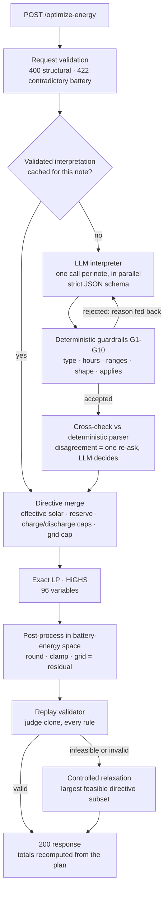
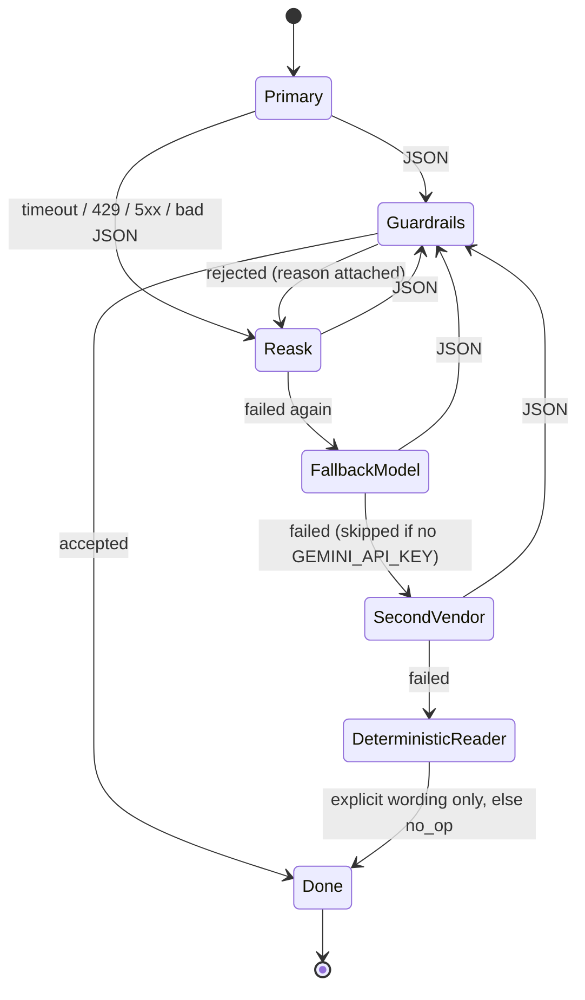
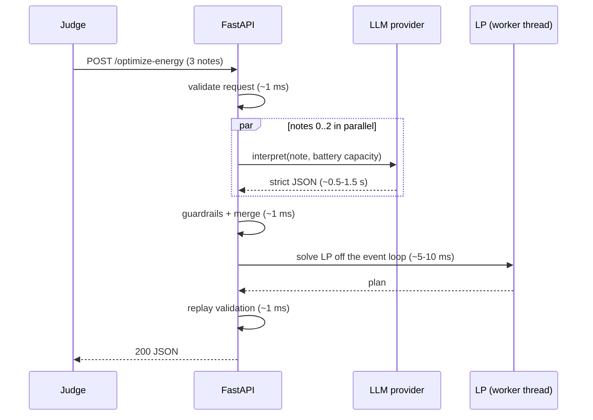

# GridWise Scheduler

<p>
  
  
  
  
  
  
  
  
  
  <a href="https://github.com/nahinio/gridwise-scheduler/actions/workflows/ci.yml"></a>
</p>

**LLM-assisted 24-hour campus energy scheduling.** A FastAPI service that reads operator
notes with a language model, hardens the interpretation with deterministic guardrails,
solves an exact linear program for minimum grid cost, replays the schedule through a
judge-clone validator, and never returns a plan it has not checked.

Built for **BUP CSE Fest 2026 Hackathon · Online Preliminary · GridWise challenge**.

| | |
|---|---|
| Required endpoints | `GET /health` · `POST /optimize-energy` |
| Port | `8000` (override with `PORT`), bound to `0.0.0.0` |
| Fallback image | `ghcr.io/nahinio/gridwise-scheduler@sha256:c0df46e03d054fe22f2086fc4186bb4b891d864aeec15ed2490f7618a0c512d1` — public, also tagged `sha-a4e01e318aac371d39c6de822dd3364b62bc9591` |
| Secrets needed to boot | none — without a key the service starts in a clearly-logged degraded mode |

---

## Contents

1. [Judge quick start](#1-judge-quick-start)
2. [Architecture](#2-architecture)
3. [How the LLM is used](#3-how-the-llm-is-used)
4. [Guardrails](#4-guardrails)
5. [Optimizer](#5-optimizer)
6. [Validator](#6-validator)
7. [API reference](#7-api-reference)
8. [Configuration](#8-configuration)
9. [Local development](#9-local-development)
10. [Testing and evals](#10-testing-and-evals)
11. [Security and secret handling](#11-security-and-secret-handling)
12. [Deployment](#12-deployment)
13. [Assumptions and known limitations](#13-assumptions-and-known-limitations)
14. [Credits](#14-credits)

---

## 1. Judge quick start

Every command below is copy-pasteable from a clean machine. Pick **one** of A / B / C to start
the service, then run the checks in D.

> Windows PowerShell: use `curl.exe` instead of `curl`.

### A. Docker fallback image (recommended)

```bash
docker pull ghcr.io/nahinio/gridwise-scheduler@sha256:c0df46e03d054fe22f2086fc4186bb4b891d864aeec15ed2490f7618a0c512d1
docker run --rm -p 8000:8000 -e OPENAI_API_KEY=<your-key> ghcr.io/nahinio/gridwise-scheduler@sha256:c0df46e03d054fe22f2086fc4186bb4b891d864aeec15ed2490f7618a0c512d1
```

The digest is the exact image that passed CI (started with no secrets, `/health` green,
`tools/check --edge` green inside the workflow). It is public: no `docker login` needed.
The image contains no secrets. `-e OPENAI_API_KEY=...` enables the LLM interpreter; leave it
out and the container still starts and answers (degraded mode, see [§3](#3-how-the-llm-is-used)).

### B. Docker, built from this repository

```bash
git clone https://github.com/nahinio/gridwise-scheduler.git
cd gridwise-scheduler
cp .env.example .env            # then set OPENAI_API_KEY in .env
docker compose up --build       # or: docker build -t gridwise-scheduler . && docker run --rm -p 8000:8000 --env-file .env gridwise-scheduler
```

### C. Plain Python (3.11+)

```bash
git clone https://github.com/nahinio/gridwise-scheduler.git
cd gridwise-scheduler
cp .env.example .env            # then set OPENAI_API_KEY in .env

# with uv (https://docs.astral.sh/uv/) - installs the locked dependency set
uv sync
uv run python -m app

# or with pip
python -m venv .venv && . .venv/bin/activate      # Windows: .venv\Scripts\activate
pip install -r requirements.txt
python -m app
```

### D. Verify

```bash
# 1. readiness
curl http://localhost:8000/health
# -> {"status":"ok"}

# 2. one public sample (three notes: solar reduction, no-charge window, distractor)
curl -X POST http://localhost:8000/optimize-energy \
     -H "Content-Type: application/json" \
     --data-binary @samples/SAMPLE-06.input.json
# -> compare with samples/SAMPLE-06.output.json  (total_cost_bdt = 34090)

# 3. the full public pack, judged the way the organizers judge it
uv run python -m tools.check --url http://localhost:8000 --edge      # pip users: python -m tools.check ...
```

Expected output of step 3:

```text
GET /health -> ok

case       interp  valid  cost delta  latency  detail
---------  ------  -----  ----------  -------  ------
SAMPLE-01  ok      ok     +0.0000     ...
SAMPLE-02  ok      ok     +0.0000     ...
   ...
SAMPLE-10  ok      ok     +0.0000     ...

10/10 cases passed | p50 ... ms | p95 ... ms

edge check                    status       result
----------------------------  -----------  ------
malformed JSON                400          ok
JSON array body               400          ok
23 hours                      400          ok
4 notes                       400          ok
empty note                    400          ok
missing battery               400          ok
initial below minimum         422          ok
prompt injection note         200          ok
20 concurrent valid requests  20/20 x 200  ok

RESULT: PASS
```

`interp` compares the machine-checked interpretation fields with the official expected
output; `valid` replays our plan under the **organizer's** directives (not ours); `cost delta`
is our recomputed cost minus the organizer's optimum (always `+0.0000`: the LP is exact).
Latency depends on the LLM provider (measured ~1.5 s per request; ~10 ms when every note is cached).

---

## 2. Architecture

One container, one process, no database, no queue — nothing that can be down when the
judge calls.

### Request pipeline



### Provider chain (per note, bounded by one request-wide deadline)



Each hop has a per-call timeout (`LLM_TIMEOUT_S`, 6 s) **and** shares one request deadline
(`LLM_TOTAL_BUDGET_S`, 12 s). When the budget is spent the chain jumps straight to the
deterministic reader, so interpretation can never push a response past the 30 s judge
timeout. A provider failure is never an HTTP 5xx.

### Timing



### Stage → module → rubric line

| Stage | Module | Rubric line it serves |
|---|---|---|
| Request contract, status codes | `app/schemas.py`, `app/errors.py`, `app/routers/core.py` | API Contract & Schema |
| LLM interpretation | `app/prompts.py`, `app/llm.py` | LLM Directive Interpretation |
| Guardrails | `app/guardrails.py` | Interpretation shape · safe failure |
| Deterministic reader / cross-check | `app/heuristic.py` | Provider-failure handling |
| Directive merge | `app/merge.py` | Directive Application |
| Optimizer + relaxation | `app/optimizer.py` | Optimization Quality · Constraint Correctness |
| Replay validator | `app/validator.py` | Constraint Correctness |
| Cache, metrics, logs | `app/cache.py`, `app/metrics.py`, `app/logs.py` | Performance & Reliability · secret safety |

More detail: [`docs/architecture.md`](docs/architecture.md). The original build plan is in [`plan.md`](plan.md).

---

## 3. How the LLM is used

**The language model produces the structured `directive_interpretation` that the optimizer
consumes.** It is not used for `plan_summary` (that text is generated deterministically),
documentation, or anything cosmetic.

| | |
|---|---|
| Provider / model | OpenAI `gpt-5.4-mini` (primary), `gpt-5.4-nano` (second hop, same key). Both are environment variables — any OpenAI-compatible endpoint works via `OPENAI_BASE_URL`. |
| Optional second vendor | Gemini Flash through Google's OpenAI-compatible endpoint, **only if** `GEMINI_API_KEY` is set. |
| Call shape | `chat.completions` with **strict JSON-schema structured outputs**, `reasoning_effort=none`, 600 output tokens max. Optional parameters an endpoint rejects are dropped automatically and remembered. |
| Granularity | **One call per note, in parallel.** No cross-note contamination, per-note retry and caching, same wall-clock as one call. |
| Prompt | Static ~2.4k-token system prompt (so provider prompt caching engages): the six types, the whole-hour start-inclusive/end-exclusive rule with examples, `factor` = fraction that *remains*, %-of-capacity → kWh using the battery capacity we pass in, kW ≙ kWh per hour, charge vs discharge vocabulary, when a note is `no_op`, and 12 contrastive few-shot pairs (including Bangla and a prompt-injection attempt). |
| Note handling | The note is passed as a JSON **data** field, never concatenated into instructions. The schema leaves no free-text channel except `explanation`, which is sanitised and length-capped. |
| What the LLM never does | Arithmetic on the schedule, constraint checking, cost calculation. All math is deterministic. |

**Degraded mode.** `app/heuristic.py` is a deterministic reader for *explicit* wording
("from 6 PM until 9 PM", "80% reduction", "155 kWh"). It is used only (a) as the last hop
when every LLM call has failed, so the API still answers instead of returning a 5xx, and
(b) as a cross-check: when it confidently disagrees with the LLM about hours or a number,
the LLM is asked to re-read the note **once** and the LLM's answer stands — the parser never
overrides the model. **The keyword reader is a degraded fallback; it is not the
interpretation path.** Without any API key the service logs `startup_degraded_mode` and
`/stats` reports `"degraded_mode": true`.

---

## 4. Guardrails

Model output is untrusted data until `validate_interpretation()` accepts it. A rejection's
reason is sent back to the model for one corrective re-ask; after that the chain moves on.

| # | Check | On failure |
|---|---|---|
| G1 | Note mapping is owned by the service (one call per note; the response index is ours), so every note appears exactly once, in order. | model's `note_index` is ignored |
| G2 | `directive_type` is one of the six published values | reject `unknown_type` |
| G3/G4 | `applies` is `false` **iff** the type is `no_op` | reject `applies_type_conflict` |
| G5 | `hours`: integers 0–23, de-duplicated, ascending, at least one | repair, or reject `bad_hours` |
| G6 | `solar_reduction.factor` finite and in `[0, 1]`; a value in `(1, 100]` is **rejected**, never silently divided by 100 | reject `factor_looks_like_percent` / `factor_out_of_range` |
| G7 | reserve finite, `0 ≤ kWh ≤ battery capacity` | reject `reserve_out_of_range` |
| G8 | `max_grid_kwh` finite and `≥ 0` | reject `grid_cap_invalid` |
| G9 | numeric fields that do not belong to the type are ignored, never applied | — |
| G10 | `explanation` stripped of control characters, ≤ 300 chars | normalise |
| G11 | cross-check against the deterministic parser | one neutral re-ask; the LLM decides |

`structured_adjustment` and `applies` in the response are **derived from the typed
directive**, so the emitted shape is exactly the Problem Statement's
(`{"hours":[…],"factor":n}` …, `null` for `no_op`) regardless of what the model wrote.
Design rationale: a wrong `no_op` costs one note's credit; an invented constraint or a crash
costs the whole case.

---

## 5. Optimizer

Exact linear program, solved with HiGHS (`scipy.optimize.linprog`). Per hour `h`: grid `g`,
solar used `s`, charge `c`, discharge `d` — 96 non-negative variables.

```text
minimise    Σ tariff_h · g_h
subject to  g_h + s_h + d_h − c_h = demand_h                      energy balance
            s_h ≤ effective_solar_h                               solar_reduction applied
            c_h ≤ charge_cap_h ,  d_h ≤ discharge_cap_h           0 inside no-charge / no-discharge windows
            g_h ≤ grid_cap_h                                      max_grid_window
            reserve_h ≤ E0 + Σ_{k≤h}(c_k − d_k) ≤ capacity        reserve_h = max(base minimum, directive)
            Σ c_h − Σ d_h = 0                                     end-of-day neutrality
```

- **Optimal by construction** — all 10 public reference costs are reproduced exactly (`tests/test_optimizer.py`).
- **Tie-breaking:** a vanishing penalty on battery throughput (total weight 0.001 BDT) picks,
  among equal-cost optima, the plan with no pointless cycling and never both charge and
  discharge in one hour. The true cost moves by less than 0.001 BDT.
- **Post-processing in battery-energy space:** the energy trajectory is rounded to 4 dp and
  clamped to `[reserve_h, capacity]` and to the hourly rate limits; the last hour is set to the
  initial energy exactly; `battery_kwh` and the action are derived from the difference; grid is
  the residual of the balance equation; totals are summed from the final plan. Bounds, rates
  and neutrality therefore hold exactly rather than "within rounding".
- **Overlapping directives** merge to the tightest limit: solar factors multiply, reserves take
  the max, grid caps take the min, windows union.
- **One dedicated solver thread.** Every solve runs on a single long-lived thread (`lp-solver`). We measured the native solver stack segfaulting or deadlocking when entered from short-lived / freshly spawned threads — what a default thread pool does under a request burst — while a dedicated thread was clean over thousands of solves. A solve takes ~5 ms, so serialising costs nothing; the stage is also time-boxed (8 s budget, HiGHS `time_limit`), after which the battery-idle plan is returned instead of a late response.
- **Controlled relaxation:** organizer scenarios are feasible under the true directives, so an
  infeasible LP means one of *our* interpretations is wrong. The service then keeps the
  largest feasible subset of directives (dropping grid caps first, then reserves, then
  windows, then solar), logs `schedule_fallback`, and says so in `plan_summary` — it does not
  crash and does not return an arbitrary plan.

---

## 6. Validator

`app/validator.py::replay_and_check` replays a plan hour by hour exactly as §9 and §11 of
the Problem Statement describe: 24 ordered hours · finite non-negative numbers · idle ⇒
`battery_kwh = 0` · charge/discharge rate limits · no-charge / no-discharge windows ·
`solar_used ≤ effective solar` · energy balance · battery transitions and bounds with raised
reserves · grid caps · end-of-day neutrality · reported totals vs totals recomputed from the
plan.

**The same function runs in three places:** on every API response before it is sent
(tolerance 1e-6, a wide margin under the judge's 0.01), in the test-suite (reference plans
pass; 17 mutations are each caught by name), and in `tools/check.py` against a live URL
using the **organizer's expected directives**.

---

## 7. API reference

Interactive docs: `GET /docs` · schema: `GET /openapi.json`.

### Required endpoints (the judged contract)

| Method | Path | Success | Errors |
|---|---|---|---|
| `GET` | `/health` | `200 {"status":"ok"}` — touches no dependency, green as soon as the process listens | — |
| `POST` | `/optimize-energy` | `200` with `scenario_id`, `directive_interpretation`, `hourly_plan[24]`, `total_grid_kwh`, `total_cost_bdt`, `peak_grid_kwh`, `plan_summary` | `400`, `422`, `500` |

Request and response follow the Problem Statement §07 / §10 exactly. A complete example pair:
[`samples/SAMPLE-06.input.json`](samples/SAMPLE-06.input.json) →
[`samples/SAMPLE-06.output.json`](samples/SAMPLE-06.output.json).

| Situation | Status |
|---|---|
| Body is not JSON / not an object / wrong types / missing fields / not exactly 24 unique hours 0–23 / 0 or >3 notes / blank note / negative, `NaN` or infinite numbers / body > 256 KB | `400` |
| Well-formed but contradictory battery (`minimum ≤ initial ≤ capacity` violated) | `422` |
| Any LLM provider failure, malformed model output | `200` via the fallback chain — never 5xx |
| Unexpected bug | `500` envelope, traceback in logs only |

Unknown extra fields in a request are **ignored**, not rejected, and the body is parsed
regardless of `Content-Type`. Error envelope (never contains class names, paths, stack
frames or secrets):

```json
{"error": "bad_request", "detail": [{"field": "hours", "message": "hours must contain exactly 24 entries"}], "request_id": "…"}
```

### Optional endpoints (not part of the judged contract)

Disabled with `ENABLE_OPTIONAL_ENDPOINTS=false`. Tagged `[OPTIONAL]` in Swagger.

| Method | Path | Purpose |
|---|---|---|
| `GET` | `/stats` | Aggregate counters (requests by status, provider used, guardrail rejects, cache hits, fallbacks, tokens) and p50/p95 latency per stage. No request content. Resets on restart. |
| `POST` | `/interpret` | Body `{"operator_notes":[…],"battery_capacity_kwh":n}` → interpretation plus `provider`, `guardrail_status`, `attempts`, `raw_llm_output`. Runs only the LLM + guardrails stage. |

---

## 8. Configuration

Environment variables only (`.env` is read if present). **Names only — never commit values.**
Template: [`.env.example`](.env.example).

| Variable | Default | Meaning |
|---|---|---|
| `OPENAI_API_KEY` | — | Enables the LLM interpreter (primary + second hop). |
| `OPENAI_BASE_URL` | OpenAI | Any OpenAI-compatible endpoint. |
| `OPENAI_MODEL` | `gpt-5.4-mini` | Primary model identifier. |
| `OPENAI_FALLBACK_MODEL` | `gpt-5.4-nano` | Second hop on the same key. |
| `OPENAI_REASONING_EFFORT` | `none` | Blank to omit the parameter. |
| `GEMINI_API_KEY` | — | Optional second vendor; hop skipped when empty. |
| `GEMINI_BASE_URL` / `GEMINI_MODEL` | Google OpenAI-compat / `gemini-2.5-flash` | |
| `LLM_TIMEOUT_S` / `LLM_TOTAL_BUDGET_S` | `6` / `12` | Per-call timeout / per-request interpretation deadline. |
| `LLM_MAX_CONCURRENCY` | `48` | Simultaneous provider calls (20 concurrent 3-note requests fit in one wave). |
| `CACHE_MAX_ENTRIES` | `5000` | LRU of validated interpretations (fallback results are never cached). |
| `CROSSCHECK_ENABLED` | `true` | Guardrail G11. |
| `ENABLE_OPTIONAL_ENDPOINTS` | `true` | `/stats`, `/interpret`. |
| `PORT` / `LOG_LEVEL` | `8000` / `INFO` | |

---

## 9. Local development

```bash
uv sync                                   # runtime + dev dependencies, locked
uv run python -m app                      # serve on :8000
uv run pytest -q                          # 289 tests, no keys, ~10 s
uv run ruff check . && uv run ruff format --check . && uv run mypy app tools
uv run python -m tools.check --url http://localhost:8000 --edge --save-samples
uv run python -m tools.eval --repeat 3    # needs OPENAI_API_KEY
uv run python -m tools.load --url http://localhost:8000 --concurrency 20 --n 40 --unique-notes
uv run python -m tools.make_samples       # regenerate samples/*.input.json + evals/public_cases.jsonl
```

```text
app/        config · schemas · prompts · llm · guardrails · heuristic · merge · optimizer ·
            validator · cache · metrics · logs · errors · summary · routers/{core,optional}
tools/      check (acceptance) · eval (LLM evals) · load (concurrency) · make_samples
tests/      schemas · validator · merge · optimizer · guardrails · heuristic · llm · api
evals/      public_cases · paraphrases · distractors · adversarial   (89 notes)
samples/    SAMPLE-XX.input.json + our SAMPLE-XX.output.json
docs/       architecture.md · official/ (the three organizer files, unmodified)
```

---

## 10. Testing and evals

| Layer | Command | What it proves |
|---|---|---|
| 1. Deterministic | `uv run pytest -q` | All 10 reference plans are valid under the judge clone; 17 plan mutations are each caught; **our cost equals the organizer optimum on 10/10 cases**; property tests (Hypothesis) — any feasible random scenario yields a strictly valid plan no worse than battery-idle; guardrails never raise and never emit an out-of-range directive on fuzzed model output; the provider chain (timeout, 429, bad JSON, guardrail reject, deadline, all-providers-down, cache, single-flight, cross-check) with scripted fakes; the HTTP contract (status codes, schema, order, echo, malformed pack, 20 concurrent, no traceback leakage). No API key needed. |
| 2. LLM evals | `uv run python -m tools.eval` | Real-provider accuracy on 89 notes by family (time, quantity, charge-vs-discharge, chatter, distractors, injection, unsupported types, Bangla, Banglish, noise): applies / type / exact hours / numeric ±0.01 / full match, confusion matrix, fallback rate, latency, tokens, run-to-run consistency. Gates: public 100 %, paraphrases ≥ 95 %, distractors 100 %, adversarial 100 %. |
| 3. Acceptance | `uv run python -m tools.check --url … --edge` | Judges a **running** service: interpretation vs expected, replay under the organizer's directives, cost delta, latency, malformed-input behaviour, 20-request burst. |
| 4. Load | `uv run python -m tools.load … --unique-notes` | p50 / p95 / max and error count at concurrency 20; `--unique-notes` makes every note textually unique so the cache cannot flatter the numbers. |

### Measured results (single process, laptop, live `gpt-5.4-mini`, interpretation cache **off**)

| Check | Result |
|---|---|
| LLM eval, 89 notes × 3 runs | **100 %** applies / type / hours / numeric on every family, incl. Bangla, Banglish, injection and unsupported-type notes · 89/89 answered first try by the primary model · **89/89 identical across the 3 runs** · 0 guardrail rejects · 0 cross-check re-asks |
| Acceptance (`tools/check --edge`) | 10/10 interpretation · 10/10 valid under organizer directives · cost delta +0.0000 on every case · **p50 1.6 s, p95 1.9 s** · edge pack all ok |
| Burst (`tools/load --concurrency 20 --n 40 --unique-notes`) | every note unique, so no cache or de-duplication help: **0 errors, p50 2.0 s, p95 2.8 s**, no rate-limit hits |
| Heavy burst (`tools/load --concurrency 50 --n 300`, notes cached) | 300 requests, 50 at a time, all through the single solver thread: **0 errors, p95 0.46 s**; service healthy afterwards |

Honest caveats: the eval notes were written by the same team that wrote the prompt, so 100 %
here is a regression gate, not a promise about unseen wording. And the deterministic reader
was developed against these same notes — its score on them says nothing about paraphrases it
has never seen, and it cannot read Bangla or Banglish at all. That is precisely why the LLM
is the interpreter and the reader is only a fallback.

---

## 11. Security and secret handling

- Secrets come from environment variables only. `.env` is git-ignored; `.env.example` has names only; the Docker image has no `ENV`/`ARG` secrets and CI fails the build if one appears in the image history.
- Keys are held as `SecretStr`; a log processor masks configured key values and anything shaped like `sk-…`, `gsk_…`, `AIza…`, `Bearer …`.
- Request bodies and note text are **never logged** — notes appear as a 12-hex hash plus length. `/stats` exposes aggregates only.
- Error responses never include exception names, file paths, stack frames or provider messages (asserted in tests).
- Input hardening: 256 KB body cap, note length cap (long notes are truncated for the model, not rejected), strict number types, no `eval`, no file or network access driven by request content.
- Prompt injection: notes are data inside a JSON field; the prompt says to classify, never obey; the strict schema leaves no channel for free-form output; guardrails bound every number; the only effect a note can have is one of five typed constraints or `no_op`.
- Container runs as a non-root user; dependencies are pinned by `uv.lock`.

---

## 12. Deployment

```bash
docker run -d --name gridwise --restart unless-stopped -p 8000:8000 \
  -e OPENAI_API_KEY=<your-key> \
  ghcr.io/nahinio/gridwise-scheduler@sha256:c0df46e03d054fe22f2086fc4186bb4b891d864aeec15ed2490f7618a0c512d1
```

- `.github/workflows/docker-publish.yml` builds the image on every push to `main`, **starts it with no secrets, waits for `/health`, runs `tools/check.py --edge` against the container**, and only then pushes `ghcr.io/nahinio/gridwise-scheduler:sha-<full-commit>` and `:main`; the digest is printed in the job summary. Docs-only commits do not rebuild the image, so the pinned digest stays the current code.
- `HEALTHCHECK` is built into the image; cold start to `/health` is a few seconds; nothing is downloaded at runtime.
- Host requirement: an always-on machine or paid tier (a sleeping free tier would turn the first judged request into a timeout).

---

## 13. Assumptions and known limitations

**Assumptions** (all from the Problem Statement): whole-hour windows, start inclusive / end
exclusive; `factor` is the fraction that remains; for one-hour intervals kW is read as kWh;
organizer scenarios are feasible and each note maps to exactly one type or `no_op`.

**Known limitations**

- A note that forbids **both** charging and discharging can only become one directive (contract: one entry per note). The prompt picks the direction mentioned first, else `no_discharge_window`.
- A range that wraps past midnight ("11 PM until 1 AM") keeps only today's hours → `[0, 23]`.
- Clock times with no AM/PM and no context are read as written ("from 2 to 4" → `[2, 3]`), except solar notes, which are read as daylight hours.
- Notes that would change demand, tariffs or battery ratings are `no_op` by design — those are not supported directive types and are never approximated.
- Degraded mode (no key / all providers down) understands explicit English wording only.
- `/stats` counters and the interpretation cache are in-memory and reset on restart; the service is designed for one process (`--workers 1`).
- If our own interpretation makes the LP infeasible, a directive is relaxed (logged and stated in `plan_summary`); that case would not pass the judge's replay for the relaxed directive.

---

## 14. Credits

- **Libraries:** [FastAPI](https://fastapi.tiangolo.com/), [Uvicorn](https://www.uvicorn.org/), [Pydantic](https://docs.pydantic.dev/) & pydantic-settings, [SciPy](https://scipy.org/) with the [HiGHS](https://highs.dev/) LP solver, [NumPy](https://numpy.org/), [openai-python](https://github.com/openai/openai-python), [HTTPX](https://www.python-httpx.org/), [structlog](https://www.structlog.org/); dev: pytest, pytest-asyncio, Hypothesis, Ruff, mypy, [uv](https://docs.astral.sh/uv/).
- **Model providers:** OpenAI (primary), Google Gemini (optional second vendor).
- **AI coding assistance:** Claude Code (Anthropic) was used as a coding assistant, as permitted by the rulebook; architecture, design decisions and review are the team's own.
- **Challenge material:** BUP CSE Fest 2026 problem statement, rubric and public sample pack (`docs/official/`, unmodified).

**Team:** [@nahinio](https://github.com/nahinio)

License: [MIT](LICENSE)
