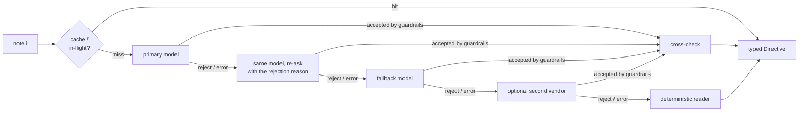

# Architecture notes

Companion to the [README](../README.md). The README shows the pipeline; this file records
*why* each stage is shaped the way it is, in the order a request meets them.

## How the judge sees us

The judge is a script. For every hidden case it (1) compares `directive_interpretation`
with its ground truth, (2) **replays `hourly_plan` under its own directives, not ours**,
(3) recomputes the totals, and only then (4) scores cost as
`min(1, organizer_optimum / our_cost)`.

Consequence: one misread note loses interpretation credit *and* usually invalidates the
plan under the true directive, which zeroes application and optimization credit for that
case too. The design therefore spends its effort in this order: **understand the note →
validate it → apply it → prove the plan valid → be cheap.**

## 1. Request validation (`app/schemas.py`, `app/routers/core.py`)

- The body is read by hand (size-capped stream → `json.loads` → Pydantic), so any
  `Content-Type` is accepted and every parse failure maps to a precise `400`.
- Request models use `extra="ignore"`: a harness that attaches metadata must not turn a
  valid case into a `400`. Strictness lives where it is safe — on the contract fields
  (numbers must be real JSON numbers: `true` and `"12"` are rejected, `NaN`/`Infinity` too),
  on model output, and on our own response models (`extra="forbid"`).
- `hours` must be a permutation of 0..23; they are sorted internally, so order is free.
- `422` is reserved for one thing: a battery whose `minimum ≤ initial ≤ capacity` is broken.

## 2. Interpretation (`app/llm.py`, `app/prompts.py`)

- **Deadline, not just timeouts.** Four hops × a per-call timeout can exceed the judge's
  30 s limit. Every call is clipped to `min(LLM_TIMEOUT_S, time left in LLM_TOTAL_BUDGET_S)`;
  when less than 0.75 s remains the chain goes straight to the deterministic reader.
  SDK-level retries are disabled (`max_retries=0`) because retries must respect that deadline.
- **Parameter negotiation.** `reasoning_effort`, `prompt_cache_key`, `max_completion_tokens`
  and strict `json_schema` are not supported by every OpenAI-compatible endpoint or model
  generation. A `400` naming one of them drops/downgrades that parameter once and remembers
  it, instead of failing every request.
- **Cache + single flight.** Key = `sha256(prompt version | capacity | normalised note)`.
  Only LLM answers that passed the guardrails are cached; fallback results never are, so a
  provider outage cannot poison later requests. Identical notes arriving concurrently share
  one in-flight call.
- **Note mapping is ours.** One call per note and the response index is set by the service,
  so "each note appears exactly once, in order" holds by construction; the model's echoed
  `note_index` is ignored.
- **Warm-up** runs as a background task at startup. `/health` never waits for it.

### Cross-check (guardrail G11)

The costliest mistake is an off-by-one window ("until 4 PM" read inclusively). The
deterministic parser reads explicit clock ranges reliably, so when it is *confident* and
disagrees with the LLM on hours or a number (same directive type), or the LLM says `no_op`
while the parser sees a complete explicit directive, the LLM gets **one** neutral re-ask
("a deterministic parser read … ; correct the JSON or repeat your answer if certain").
Whatever valid answer comes back stands. The parser is advisory only — deterministic code
never replaces the language model's interpretation.

## 3. Merge (`app/merge.py`)

Directives become five per-hour arrays: effective solar, minimum reserve, charge cap,
discharge cap, grid cap. Overlaps combine to the tightest limit (product / max / zero /
zero / min), so two notes touching the same hour need no special handling anywhere else.
The optimizer and the validator both consume exactly these arrays.

## 4. Optimizer (`app/optimizer.py`)

- 96-variable LP, HiGHS. Exact optimum; verified equal to all 10 organizer reference costs.
- A throughput penalty whose *total* weight is 0.001 BDT breaks ties between equal-cost
  optima toward the plan with the least battery cycling. It removes degenerate
  charge-and-discharge-in-the-same-hour solutions at the source.
- **Rounding happens on the battery-energy trajectory**, not on charge/discharge amounts:
  each `E_h` is rounded to 4 dp, clamped to `[reserve_h, capacity]` and to what the hourly
  rate allows from `E_{h-1}`, and `E_23` is set to `E_0` exactly. `battery_kwh` is the
  difference, the action is its sign, and `grid_kwh` is the residual of the balance
  equation. Bounds, rates and neutrality are therefore exact rather than "close".
- Totals are summed from the final plan — never taken from the LP objective.
- **Threading.** All solves go through one long-lived `lp-solver` thread. Found by stress test:
  one *new* thread per solve segfaulted (exit 139) in 2 of 3 runs and overlapping new threads
  deadlocked in 3 of 3, whereas 16 long-lived threads (1,800 solves) and one dedicated thread
  (1,200 solves) were clean. `asyncio.to_thread` creates threads on demand during a burst, so
  it was replaced. The stage is time-boxed as well: HiGHS gets a `time_limit`, relaxation shares
  an 8 s budget, and the API waits at most budget + 2 s before answering with the idle plan.

### Failure ladder

| Situation | Response |
|---|---|
| LP optimal, replay valid (tolerance 1e-6) | the plan |
| LP infeasible under our directives | largest feasible subset of directives (drop order: grid caps → reserves → windows → solar); logged as `schedule_fallback=relaxed`; stated in `plan_summary` |
| Replay finds a violation (not expected) | whichever of {LP plan, battery-idle plan} has fewer violations; logged with the violated rules |

A battery-idle "safe plan" is **not** used unconditionally: with an active grid cap it is
itself invalid (public cases 05, 07 and 10 need the battery to stay under the cap).

## 5. Validator (`app/validator.py`)

A pure function that mirrors the Problem Statement §9/§11 rule by rule and names each
violation (`energy_balance@7`, `no_charge_window@14`, …). Internally we require 1e-6; the
judge allows 0.01.

## 6. Operations

- Structured JSON logs with a request id; notes appear only as hash + length.
- `/stats`: requests by status, provider used, guardrail rejects by reason, LLM errors by
  kind, cache hits, cross-check re-asks/changes, schedule fallbacks, tokens, and p50/p95 for
  `llm_ms`, `lp_ms`, `total_ms`.
- One process, one event loop; the LP runs in a worker thread so a burst of requests never
  blocks the loop.
