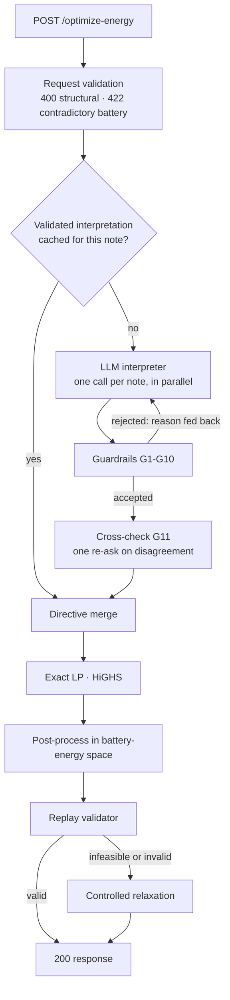
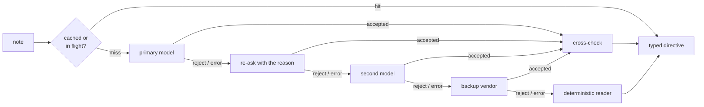

# Architecture notes

Companion to the [README](../README.md). The README shows *what* the pipeline is; this file
records *why* each stage is shaped the way it is, in the order a request meets them.

## Design principle

A correct interpretation is worth nothing if the schedule ignores it, and a cheap schedule
is worth nothing if it breaks a rule. The pipeline therefore spends its effort in this
order: **understand the note → validate it → apply it → prove the plan valid → be cheap.**

## 1. Request validation — `app/schemas.py`, `app/routers/core.py`

- The body is read by hand (size-capped stream → `json.loads` → Pydantic), so any
  `Content-Type` is accepted and every parse failure maps to a precise `400`.
- Request models ignore unknown fields: a client that attaches metadata must not turn a
  valid request into an error. Strictness lives where it is safe — on the contract fields
  (numbers must be real JSON numbers: `true`, `"12"`, `NaN` and `Infinity` are rejected), on
  model output, and on the response models.
- `hours` must be a permutation of 0..23; they are sorted internally, so order is free.
- `422` is reserved for one case: a battery whose `minimum ≤ initial ≤ capacity` is broken.

## 2. Interpretation — `app/llm.py`, `app/prompts.py`

- **A deadline, not just timeouts.** Four hops times a per-call timeout can exceed any
  reasonable client timeout. Every call is clipped to
  `min(LLM_TIMEOUT_S, time left in LLM_TOTAL_BUDGET_S)`; when less than 0.75 s remains the
  chain goes straight to the deterministic reader. SDK-level retries are disabled because
  retries must respect that deadline.
- **Parameter negotiation.** `reasoning_effort`, `prompt_cache_key`, `max_completion_tokens`
  and strict `json_schema` are not supported by every OpenAI-compatible endpoint. A `400`
  naming one of them drops or downgrades that parameter once and remembers the decision.
- **Cache and single flight.** Key = `sha256(prompt version | capacity | normalised note)`.
  Only answers that passed the guardrails are cached; fallback results never are, so a
  provider outage cannot poison later requests. Identical concurrent notes share one call.
- **Note mapping is ours.** One call per note and the response index is set by the service,
  so "each note appears exactly once, in order" holds by construction.
- **Warm-up** runs as a background task at startup; `/health` never waits for it.
- **The prompt** is a static ~2.4k-token system message (so provider-side prompt caching
  engages): the six types, the whole-hour end-exclusive rule with examples, `factor` as the
  fraction that remains, percent-of-capacity conversion, kW ≙ kWh per hour, charge versus
  discharge vocabulary, when a note is `no_op`, and twelve contrastive examples including
  Bangla and a prompt-injection attempt.

### Cross-check (G11)

The costliest mistake is an off-by-one window ("until 4 PM" read inclusively). A
deterministic parser reads explicit clock ranges reliably, so when it is *confident* and
disagrees with the model on hours or a number — or the model says `no_op` while the parser
sees a complete explicit directive — the model gets **one** neutral re-ask. Whatever valid
answer comes back stands. The parser is advisory: deterministic code never replaces the
language model's interpretation.

## 3. Merge — `app/merge.py`

Directives become five per-hour arrays: effective solar, minimum reserve, charge cap,
discharge cap, grid cap. Overlaps combine to the tightest limit, so two notes touching the
same hour need no special handling anywhere else. The optimizer and the validator consume
exactly these arrays.

## 4. Optimizer — `app/optimizer.py`

- 96-variable LP solved with HiGHS: the exact optimum, reproduced on every reference scenario.
- A throughput penalty whose *total* weight is 0.001 BDT breaks ties between equal-cost
  optima toward the plan with the least battery cycling, which also removes degenerate
  charge-and-discharge-in-the-same-hour solutions at the source.
- **Rounding happens on the battery-energy trajectory**, not on charge and discharge
  amounts: each `E_h` is rounded to 4 dp, clamped to `[reserve_h, capacity]` and to what the
  hourly rate allows from `E_{h-1}`, and `E_23` is set to `E_0` exactly. `battery_kwh` is the
  difference, the action is its sign, and `grid_kwh` is the residual of the balance
  equation. Bounds, rates and neutrality are exact rather than "close".
- Totals are summed from the final plan — never taken from the LP objective.
- **Threading.** All solves go through one long-lived `lp-solver` thread. Found by stress
  test: one *new* thread per solve crashed the process in 2 of 3 runs and overlapping new
  threads deadlocked in 3 of 3, whereas 16 long-lived threads (1,800 solves) and one
  dedicated thread (1,200 solves) were clean. A default thread pool creates threads on
  demand during a burst, so it was replaced. The stage is time-boxed as well: HiGHS gets a
  `time_limit`, relaxation shares an 8 s budget, and the API waits at most budget + 2 s
  before answering with the battery-idle plan.

### Failure ladder

| Situation | Response |
|---|---|
| LP optimal, replay valid (tolerance 1e-6) | the plan |
| LP infeasible under the interpreted directives | largest feasible subset (drop order: grid caps → reserves → windows → solar); logged; stated in `plan_summary` |
| Replay finds a violation (not expected) | whichever of {LP plan, battery-idle plan} has fewer violations; logged with the violated rules |

A battery-idle plan is **not** used as an unconditional fallback: with an active grid cap it
can itself be invalid, because the battery is what keeps imports under the cap.

## 5. Validator — `app/validator.py`

A pure function that checks a plan rule by rule and names each violation
(`energy_balance@7`, `no_charge_window@14`, …). Internally the service requires 1e-6; the
specification allows 0.01.

## 6. Operations

- Structured JSON logs with a request id; notes appear only as hash + length.
- `/stats`: requests by status, provider used, guardrail rejects by reason, LLM errors by
  kind, cache hits, cross-check re-asks, schedule fallbacks, tokens, and p50/p95 for
  `llm_ms`, `lp_ms`, `total_ms`.
- One process, one event loop; the LP runs on its own thread so a burst never blocks the loop.
